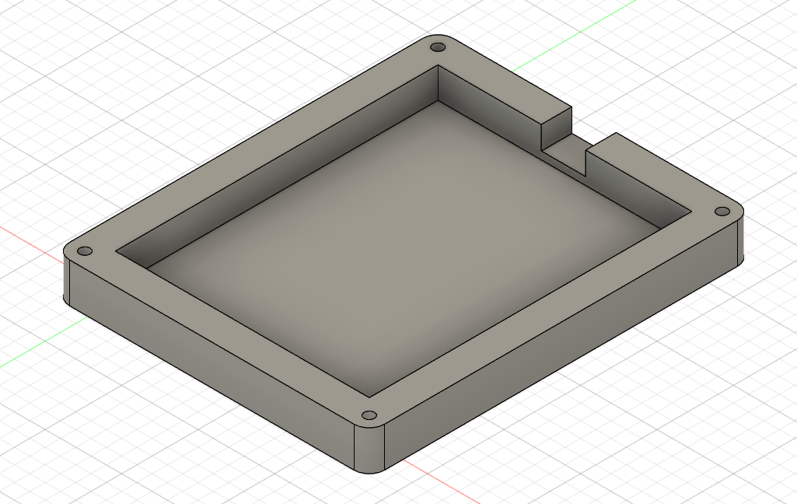
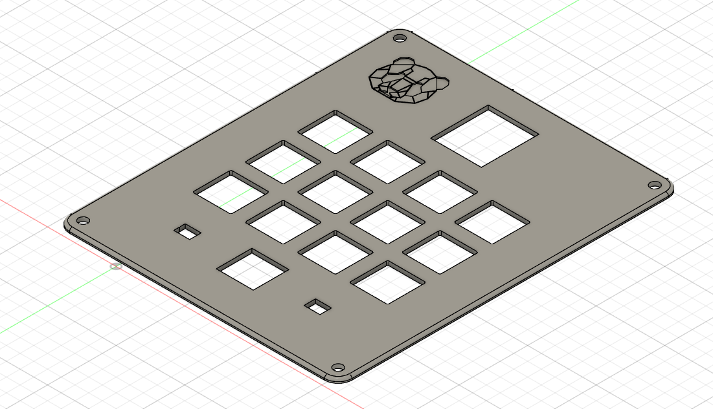
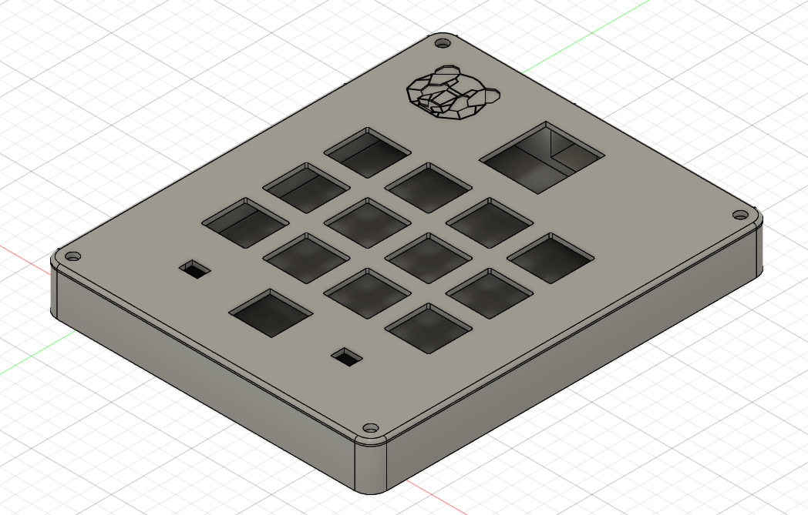
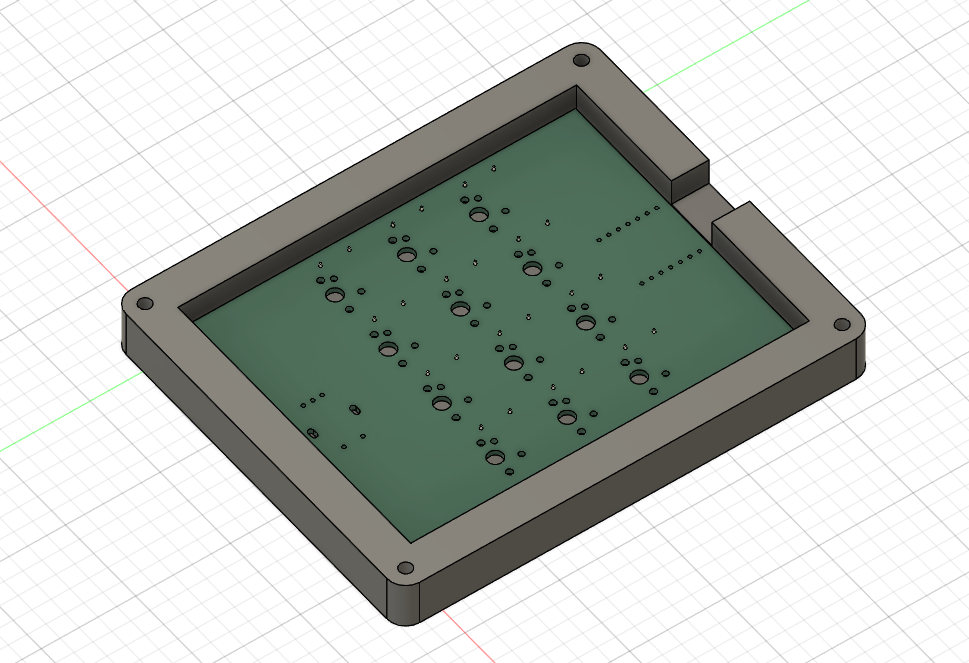
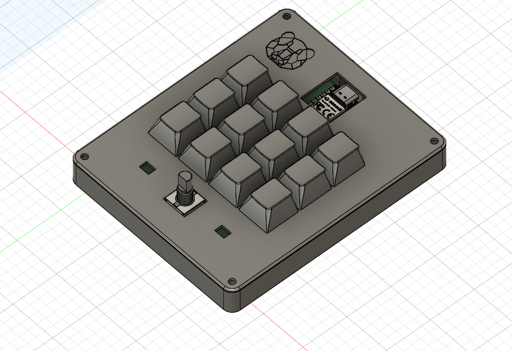
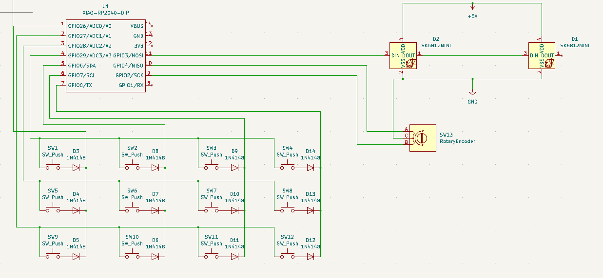

# Simulator-MacroPad

My project for the macropad contest of hackclub. It has 12 buttons as well as 1 rotary encoder with two leds which indicate the level of the encoder using colours.

I plan on using this pad to help me with my in-race adjustments, as well using it in other applications by mapping the buttons to do specific actions (like muting discord or actions of voicemod) or attaching more complex macros to them

BottomBox:

TopCover:

FullBox:

BottomBox+PCB:

Full Assemble:

PCB:

Wiring Schematic:

